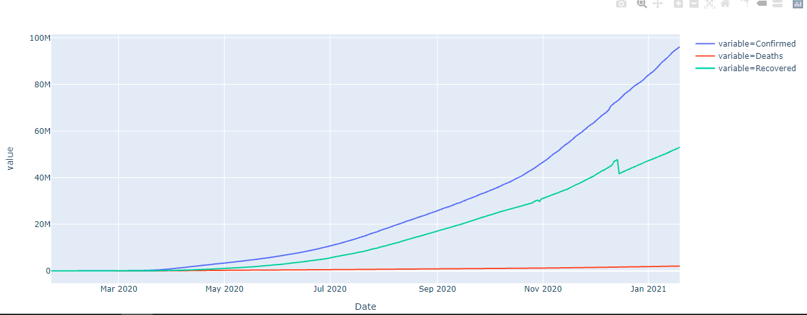
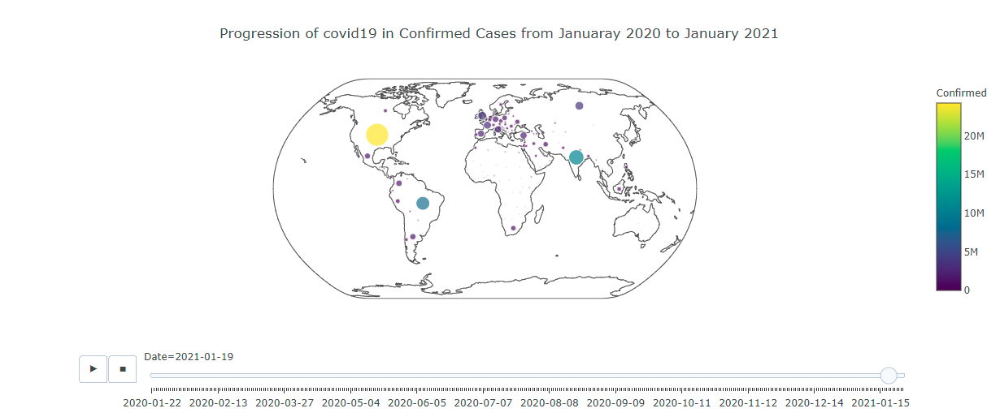

# COVID-19_analysis
- Project for learning: Time series with RNN-LSTM + Visualization
- Dataset from: https://www.kaggle.com/sudalairajkumar/novel-corona-virus-2019-dataset
- Time series dataset from: https://github.com/CSSEGISandData/COVID-19

# Result distribution from January 2020 to January 2021

 | 

- Total number of confirmed cases over these day:  96158735
- Total number of death cases over these day:  2056996
- Total number of recover cases over these day:  53035240
- In Vietnam there are 1540 confirmed cases, 35 death cases, 1402 recover cases until 19/01/2021.